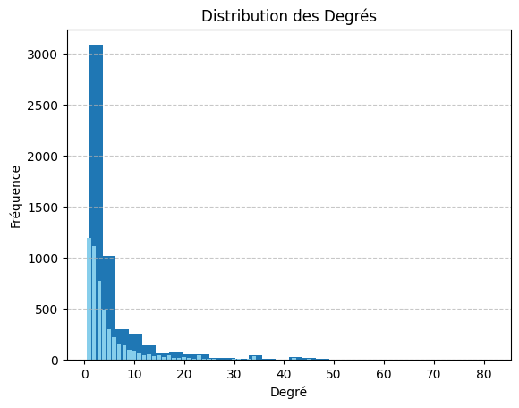
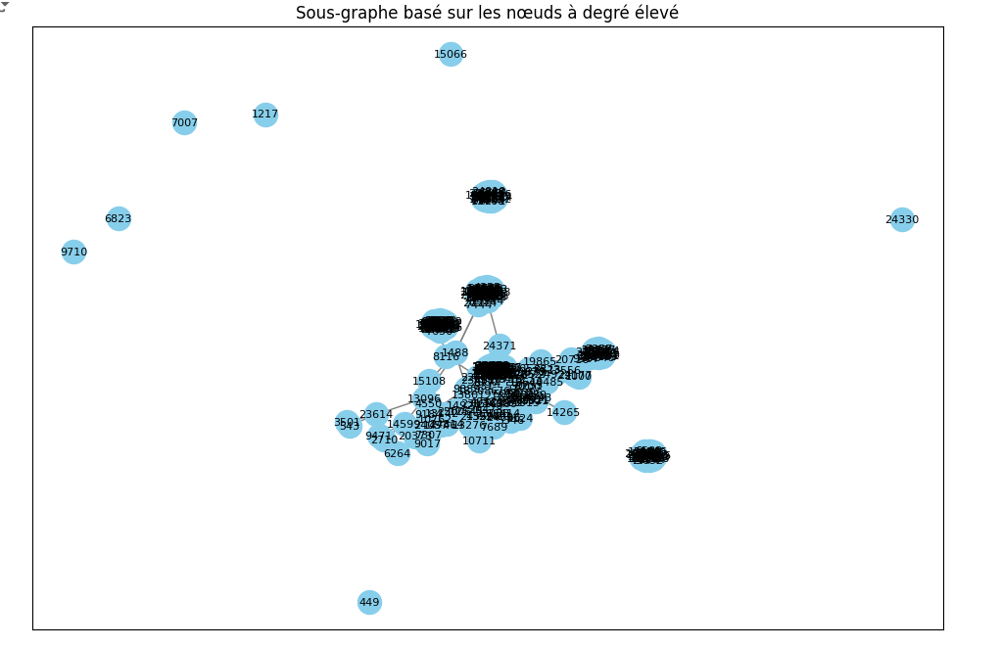
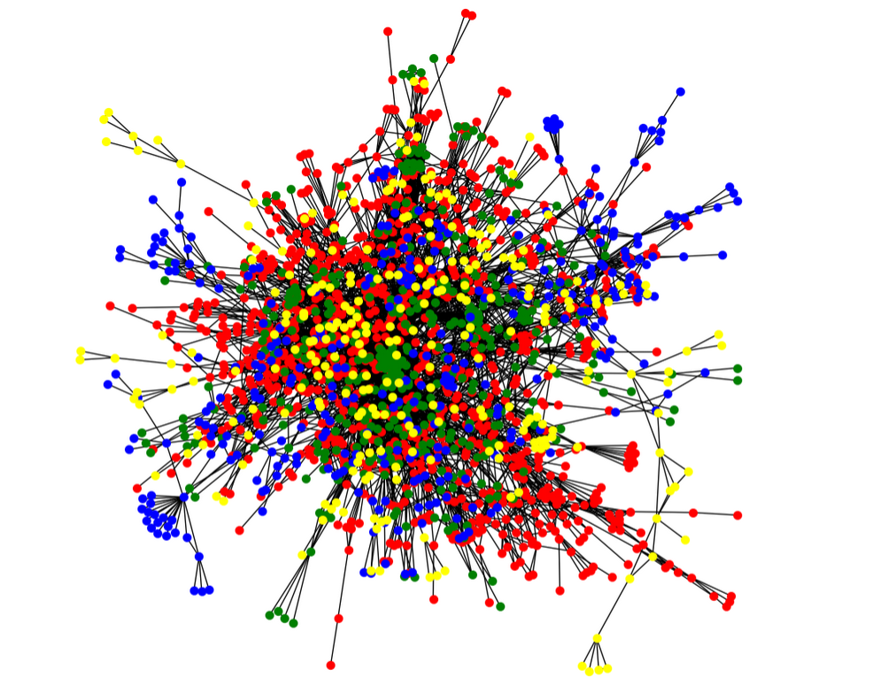

# Analysis of a Scientific Collaboration Network

## Overview
This repository contains a Jupyter Notebook for analyzing a scientific collaboration network using NetworkX, Pandas, and Matplotlib. The data represents collaborations between authors in the form of an undirected graph, where each node is an author and each edge represents a collaboration.

The main steps covered in the analysis include:
- Loading the dataset and creating the network graph.
- Performing preliminary analysis, including calculating the average degree of nodes.
- Visualizing key parts of the network.
- Calculating centrality measures to identify important nodes.
- Detecting communities to understand collaboration clusters.
- Calculating the average clustering coefficient to determine local cohesion.

## Prerequisites
The following Python libraries are required to run the notebook:
- **NetworkX**: For graph analysis and manipulation.
- **Pandas**: For data manipulation and loading.
- **Matplotlib**: For visualizing the network and results.

You can install these dependencies using pip:
```sh
pip install networkx pandas matplotlib
```

## Data
The dataset used for this analysis is the `CA-GrQc.txt` file, downloaded from [Stanford SNAP](http://snap.stanford.edu/data/ca-GrQc.html). It contains information about collaborations between authors in the General Relativity and Quantum Cosmology category on arXiv.

## Steps in the Analysis
1. **Loading and Preprocessing Data**: The dataset is loaded into a Pandas DataFrame, and a graph is created using NetworkX.

2. **Graph Construction**: We create an undirected graph where nodes represent authors and edges represent collaborations.

3. **Preliminary Analysis**:
   - **Average Degree Calculation**: The average degree of nodes in the graph is calculated to understand overall connectivity.
   - **Degree Distribution**: An histogram is plotted to visualize how many authors have similar collaboration counts.
   

4. **Graph Visualization**:
   - A subgraph containing high-degree nodes (e.g., nodes with a degree greater than 10) is visualized to observe the central players in the network.
   

5. **Centrality Measures**:
   - **Degree Centrality**: Identifies nodes with the most direct connections.
   - **Betweenness Centrality**: Highlights nodes that serve as bridges between different parts of the network.
   - **Closeness Centrality**: Shows nodes that can reach all others in the network more quickly.

6. **Community Detection**:
   - Communities are detected using the greedy modularity algorithm, which helps identify groups of authors who collaborate more frequently with each other.
   

7. **Clustering Coefficient**:
   - The average clustering coefficient is calculated to understand the tendency of nodes to form tightly knit groups.

## Results Interpretation
- **Degree Distribution**: The distribution shows that most authors have a low number of collaborations, while a few have a high number, indicating the presence of highly influential authors.
- **Central Nodes**: Nodes with high degree and betweenness centralities are key players in the network, as they have many collaborations and serve as connectors between different parts of the network.
- **Communities**: The detected communities highlight clusters of authors who tend to work together more closely.

## Conclusion
This analysis provides insights into the structure of scientific collaborations in the field of General Relativity and Quantum Cosmology. The results help identify influential authors, collaboration patterns, and community structures that facilitate further understanding of how research is conducted in this domain.

## Vidéo Explicative

Une vidéo de démonstration expliquant le projet est disponible [ici](https://docs.google.com/document/d/1OizDmup9EsFcw8WZGEYT9biMUNgviCNw4K5Fcq-kQu0/edit?usp=sharing).

## Running the Notebook
To run the notebook:
1. Clone the repository:
   ```sh
   git clone https://github.com/elbasri/NetworkX_Analysis_of_a_Scientific_Collaboration_Network.git
   ```
2. Install the dependencies:
   ```sh
   pip install networkx pandas matplotlib
   ```
3. Open the notebook and execute the cells:
   ```sh
   jupyter notebook Analysis_of_a_Scientific_Collaboration_Network.ipynb
   ```
